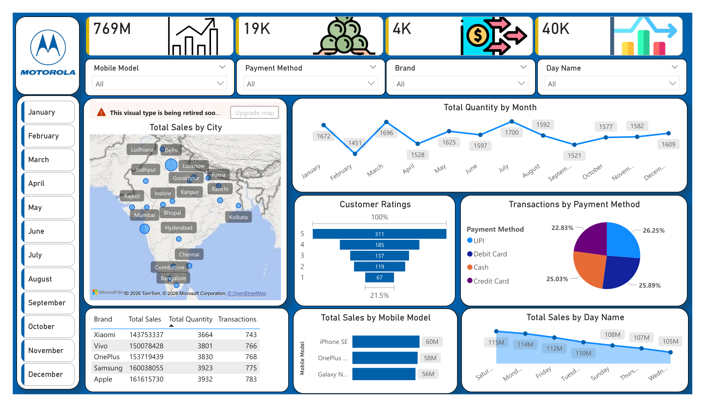
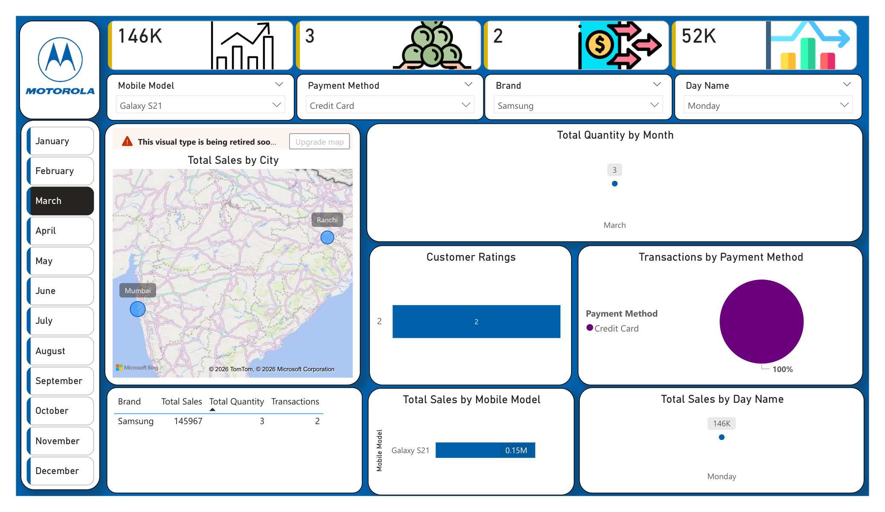
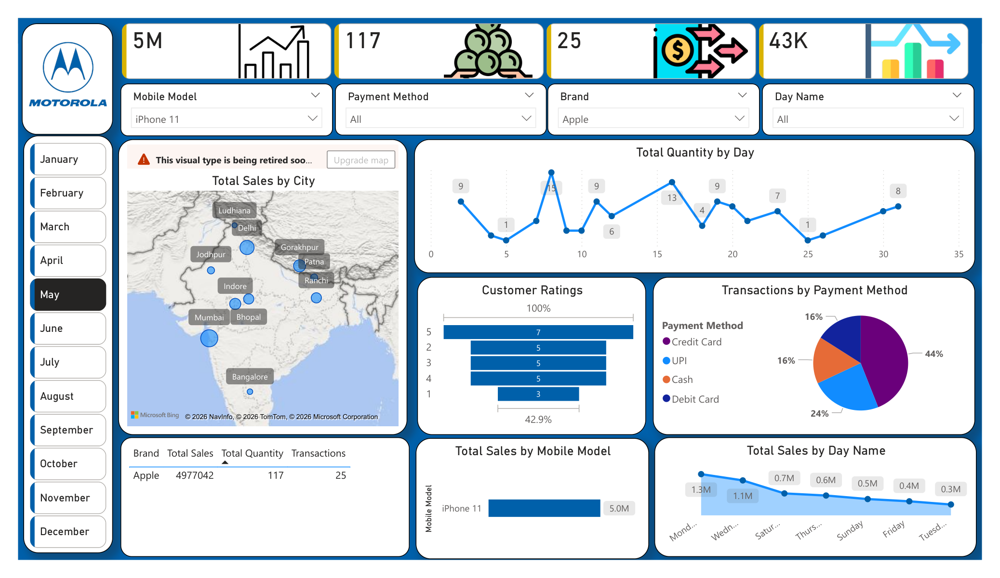
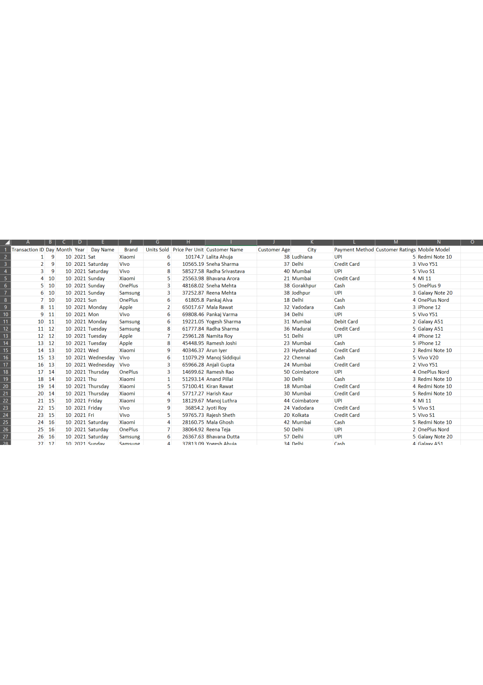

# 📱 Mobile Sales Analysis Dashboard (Power BI)

✨ **Created by: Sujal Kumar**

---

## 📄 Dashboard Preview

👉 [View Full Dashboard (PDF)](reports/dashboard.pdf)

---

## 📌 Project Overview
This project presents an **interactive Power BI Dashboard** focused on analyzing **mobile sales data across different cities, brands, and time periods**.

The dashboard provides insights into:
- Sales performance across cities  
- Monthly sales trends  
- Customer ratings  
- Payment method distribution  
- Brand-wise and model-wise performance  

---

## 🎯 Project Objective
The objective of this project is to:
- Analyze mobile sales data across India  
- Identify top-performing cities and brands  
- Track monthly and daily sales trends  
- Understand customer preferences and payment behavior  

---

## 📂 Dataset Information

The dataset used in this project is available in the `data` folder.

### 📁 Files:
- `data/data.csv`

### 📊 Data Includes:
- Mobile brand & model  
- Sales amount  
- Quantity sold  
- Customer ratings  
- Payment methods (UPI, Debit Card, Credit Card, Cash)  
- Location (City-wise data)  
- Time attributes (Month, Day)  

---

## 🔗 Live Dashboard

👉 **View Live Dashboard:**  
[https://app.powerbi.com/groups/me/reports/c54b5b93-30e8-4c2a-aa66-dacffa2d77d2/6cbf5145e4e05b0ec5c5?experience=power-bi]

---

## 📸 Dashboard Insights (PDF Reports)

### 🟢 Overview Dashboard
👉 [View Overview](reports/dashboard.pdf)

### 🔵 Insights - March Month
👉 [View March Insights](reports/insights_march.pdf)

### 🔵 Insights - May Month
👉 [View May Insights](reports/insights_may.pdf)

### 🟣 Dataset Insights
👉 [View Dataset Insights](reports/dataset_insights.pdf)

---

## 📊 Key Insights

- 📌 **Top Cities** like Delhi, Mumbai, and Bangalore contribute significantly to total sales  
- 📌 **Sales peak observed in specific months**, showing seasonal trends  
- 📌 **UPI & Card payments dominate** over cash transactions  
- 📌 **Samsung leads in total quantity sold**, while Apple generates high revenue  
- 📌 Customer ratings are mostly concentrated between **3 to 5 stars**  

---

## ⚙️ Tools & Technologies Used

- 📊 Power BI (Dashboard & Visualization)  
- 📁 CSV (Dataset)  
- 🧹 Data Cleaning & Transformation  
- 📈 Data Analysis  

---

## ✨ Features

- Interactive slicers (Month, Brand, Payment Method)  
- City-wise map visualization  
- Monthly and daily sales trends  
- Customer rating analysis  
- Brand & model performance comparison  

---

## 🛠️ How to Use

1. Clone this repository  
2. Open Power BI Desktop  
3. Load dataset from `data/data.csv`  
4. Open `.pbix` file (if available)  
5. Explore dashboard using filters  

---
